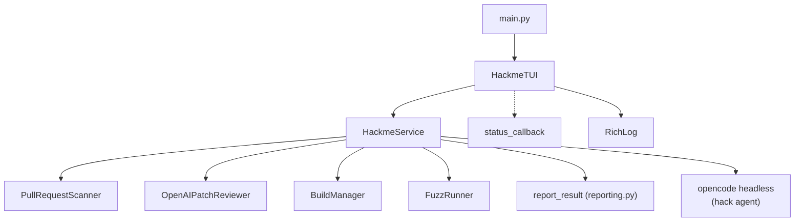
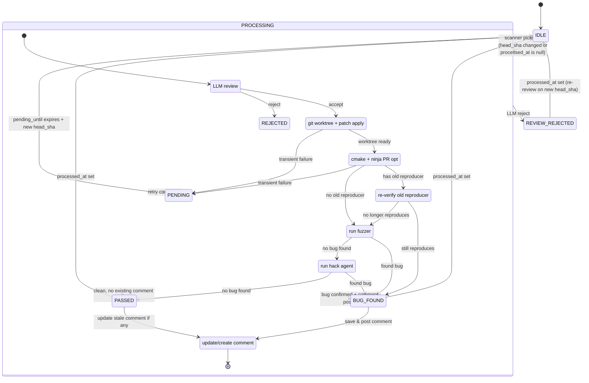

# Internals

## Architecture



Each component is a self-contained module under `llvm_hackme/`:

| Module          | Responsibility |
|-----------------|---------------|
| `config.py`     | Environment-variable-based configuration |
| `state.py`      | SQLite persistence for scan watermark and PR state |
| `github.py`     | GitHub REST API client (PRs, comments, reviews, patches) |
| `scanner.py`    | Finds open PRs with relevant file changes |
| `llm_review.py` | OpenAI patch review before any build/execution |
| `builds.py`     | LLVM baseline + PR worktrees, build orchestration |
| `passes.py`     | Pass name guessing from patch file paths |
| `fuzzer.py`     | Mutation-based fuzzing with opt + Alive2 |
| `verification.py` | Regression verification (baseline vs PR opt) |
| `reporting.py`  | GitHub comment and review creation |
| `service.py`    | Orchestrator: scan → review → build → fuzz → verify → report |
| `tui.py`        | Textual TUI header, PR list, and log panel |
| `commands.py`   | Subprocess runner with timeouts and memory limits |
| `models.py`     | Dataclasses for PullRequest, Reproducer, etc. |
| `paths.py`      | Re-exports `is_relevant_pr_file` from `passes.py` |

## PR State Machine

A PR lives in one of these states across scan cycles:



### Comment States

The `CommentState` enum controls the message posted to GitHub:

| State | When used |
|-------|-----------|
| `BUG_FOUND` | New crash or miscompilation regression found |
| `STILL_REPRODUCES` | Previously reported bug still reproduces with current PR update |
| `NO_ISSUE_FOUND_FOR_CURRENT_PATCH` | Previously reported bug no longer reproduces, and no new bug found |

All comment states include baseline revision, PR head SHA, and patch SHA256 in both HTML comment markers (`<!-- llvm-hackme-baseline: ... -->`, etc.) and human-readable text (`**Baseline Revision**: \`...\``, etc.). For `BUG_FOUND` and `STILL_REPRODUCES` these are taken from the `Reproducer`; for `NO_ISSUE_FOUND_FOR_CURRENT_PATCH` they come from the current `report_result()` parameters.

### Pending / Retry

When a transient error occurs during processing (network failures, build errors, API timeouts), the PR is NOT marked as processed. Instead:

1. `retry_count` is incremented.
2. If `retry_count >= 3`, `pending_until` is set to 30 minutes in the future, and the scanner skips the PR until that time.
3. On success (or non-transient final processing), `retry_count` is reset and `processed_at` is set.

## Deployment Constraints

- **Single-instance only** — only one `HackmeService` process runs against a given repository at a time. There is no distributed coordination; `_pr_tasks` and the SQLite DB assume exclusive ownership. Running multiple instances concurrently against the same repository can produce duplicate GitHub comments.
- When the service starts, it calls `_validate_environment()` synchronously before entering any async loop. This checks that `z3`, `llvm-symbolizer`, and `opencode` are on `PATH`, and that the configured `LLVM_HACKME_HACK_MODEL` is available.

## Comment Dedup

Each PR gets at most one llvm-hackme comment. Two layers enforce this:

1. **Process-level** — `_schedule_pr_task()` ensures only one `asyncio.Task` per PR number exists at any moment (`_pr_tasks` dict). A new update for the same PR cancels the previous task before spawning the new one.

2. **DB/API recovery** — `report_result()` checks both the local DB (`stored.comment_id`) and the GitHub API (`find_llvm_hackme_comment()`) before deciding whether to create or update:
   - **Existing comment found on GitHub but `comment_id` missing from DB**: the DB row is recovered with `save_comment()`, then the comment is updated normally. No duplicate is created.
   - **No existing comment anywhere**: a new comment is created and its ID saved to the DB.
   - **Existing comment with matching `comment_id`**: the comment is updated in-place (new reproducer or "still reproduces" status).

   The recovery path (`existing is not None` but `stored.comment_id is None`) handles DB loss/migration scenarios without creating duplicate comments.


**SQLite schema (`pull_state` table):**

| Column | Purpose |
|--------|---------|
| `pr_number` | GitHub PR number (PK) |
| `head_sha` | Last processed PR head commit |
| `patch_sha256` | SHA-256 of the last processed patch |
| `comment_id` | GitHub comment ID if a bug was reported |
| `comment_url` | URL of the posted comment |
| `reproducer_json` | Serialized `Reproducer` (only when a bug was found) |
| `processed_at` | UTC timestamp when processing fully completed |
| `updated_at` | Last update timestamp |

**Scanner logic on each cycle:**

1. Fetch open, non-draft PRs targeting `main`, updated since `scan_watermark - overlap`.
2. For each PR, fetch changed files and skip if `is_relevant_pr_file()` returns false for all.
3. Fetch the patch and compute `patch_sha256`.
4. Check `pull_state`:
   - If `head_sha == pr.head_sha` AND `patch_sha256 == computed` AND `processed_at is not null`: skip (already processed).
   - Otherwise: record `head_sha` and `patch_sha256` in state, enqueue processing task.

This means after a crash, any PR whose `processed_at` is still null will be re-picked up on restart.

## Build

All CMake builds use `RelWithDebInfo` (not `Release`) so opt crash stacktraces include debug symbols for meaningful diagnosis.

`_build_lock` (an `asyncio.Lock`) protects the LLVM baseline git repository from concurrent mutation. It is acquired during:

- **PR git operations**: `prepare_pr_worktree()` which calls `_sync_pr_worktree()` and `_apply_patch()`. PR builds (`build_pr_opt()` → `_configure_and_build_pr_opt()`) run **outside** the lock, allowing PR compilation to proceed in parallel with baseline updates.
- **Baseline git operations**: `sync_baseline_sources()` (git fetch + checkout) runs under the lock. `build_baseline_toolchain()` (cmake + ninja for baseline opt, alive2, fuzz tools) runs **outside** the lock. If the baseline build fails, `rollback_sources()` re-acquires the lock to restore the previous git revisions, then `build_baseline_toolchain()` is called again to rebuild the old version.

Build parallelism is controlled by `LLVM_HACKME_BUILD_JOBS` (default: 32). All `cmake --build` invocations use this value for `-j`.

## Pass Guessing

`passes.py` maps file paths (from `diff --git a/...` lines in the patch) to opt pass name pipelines.  The logic has three layers in strict priority order:

1. **Test paths** (`llvm/test/Transforms/<pass>/...`, excluding PhaseOrdering) -- checked first; highest priority.
2. **Source paths** (`llvm/lib/...`, `llvm/include/...`) -- medium priority; analysis files (KnownBits, ValueTracking, ConstantFolding, etc.) always map to `instcombine<no-verify-fixpoint>`.
3. **PhaseOrdering test paths** (`llvm/test/Transforms/PhaseOrdering/...`) -- lowest priority; only used when no other test or source path matches.

The same keyword list drives `is_relevant_pr_file()`, which determines whether a PR is interesting enough to process at all.

### `instcombine` normalisation

The legacy pass manager syntax `instcombine` (bare, without `<no-verify-fixpoint>`) is automatically converted to the new PM form `instcombine<no-verify-fixpoint>` via `_fixup_instcombine()` in `service.py`. This normalisation is applied to opt arguments extracted from reproducer commands (`_opt_args_from_command`) and to arguments submitted by the hack agent (`_hack_verify`). Both single-argument and `-passes=instcombine,...` forms are handled.

## Hack Agent

When mutation-based fuzzing finds no bug (or is skipped for source-only patches), a lightweight LLM agent runs. The agent is defined in `.opencode/agents/hack.md` and invoked via `opencode run --agent hack --model <model>` in headless mode. Both stdout and stderr are merged into `hack_dir/opencode.log` for post-run auditing.

The model is set via the required `LLVM_HACKME_HACK_MODEL` environment variable in `provider/model` format (e.g. `deepseek/deepseek-v4-pro`). At startup the service validates the model is present in `opencode models` output and that `z3` is on `PATH`.

### Two-pipe handshake

The Python service and the hack agent communicate through two named pipes (FIFOs) in the hack work directory:

```
Python (service.py)                   opencode (hack agent)
─────────────────────                  ─────────────────────
write context.json
os.mkfifo(submit.pipe)
os.mkfifo(response.pipe)
                                       hack_context tool reads context.json
                                       LLM analyzes patch & constructs IR
                                        hack_submit(ir, opt_args, kind, desc)
                                          │
read(submit.pipe)  ◄──────────────────── write(submit.pipe, payload)
                                          │
_hack_verify(payload)                    open(response.pipe) blocks
  ├─ regression confirmed ──► write(response.pipe, {success: true})
  │   kill opencode ────────► (process terminated)
  └─ rejected ──────────────► write(response.pipe, {success: false, reason})
                                  │
                               read(response.pipe) → return reason to LLM → retry
```

1. **Context file** (`context.json`) — written by the service; contains all binary paths, the patch file path, pass name, work directories, LLVM source tree paths, and `opt_memory_limit_bytes` (for the TS-side `prlimit` wrapper). The `hack_context` tool reads it.
2.  **Submit pipe** (`submit.pipe`) — agent writes a JSON payload `{ir, opt_args, kind, description}`. The Python service reads it and runs verification (`check_crash` / `check_miscompilation` on both baseline and PR opt).
3. **Response pipe** (`response.pipe`) — Python writes `{success: true}` on confirmed regression (then kills opencode) or `{success: false, reason}` on failed verification (agent may retry).

### Pipe deadlock recovery

If the hack agent process exits without writing to `submit.pipe` (crash, timeout, cancellation), the Python reader thread can hang indefinitely in `open(submit_pipe)` because the FIFO has no writer. After the opencode process exits (or is killed), the service:

1. Cancels the pipe listener task if still running.
2. Force-opens each pipe with `O_NONBLOCK` (write-only for submit, read-only for response) to unblock any stuck reader/writer threads.
3. Waits up to 30 seconds for `pipe_done` (set in `finally` by the pipe listener) before cleaning up.

This guarantees the service does not hang permanently regardless of how the hack agent terminates.

### Permissions and safety

- `bash: deny`, `webfetch: deny`, `write: deny`, `edit: deny` — the agent cannot modify files or run shell commands.
- `external_directory` — restricted to the two LLVM source trees (`llvm-project/`, `llvm-project-pr/`) and the hack scratch directory.
- All opt/alive2 invocations go through custom TypeScript tools (`.opencode/tools/hack_*.ts`):
  - **Path confinement** — `ir_path` arguments are resolved via `path.resolve` and checked to stay within `work_dir`; absolute paths and `..` traversal are rejected.
  - **Memory limits** — opt and alive2 are wrapped with `prlimit --as=<bytes>` using the `opt_memory_limit_bytes` from context (1 GiB default).
  - **Environment isolation** — all tool spawns use `minimalEnv()` (only `HOME`, `PATH`, `TMPDIR`, `LANG`, `LC_ALL`); secrets like `GITHUB_TOKEN` and `OPENAI_AUTH_KEY` are never exposed to child processes.
  - **Output truncation** — stdout/stderr are truncated to the last 8 000 bytes for opt/alive2 and 12 000 bytes for z3.
- `hack_submit` enforces a 10 MB IR payload limit; larger submissions are rejected.
- z3 is invoked with memory (4 GB) and time (30 s) limits via its own `-memory:` and `-T:` flags.
- The Python service enforces the overall hack time budget (`LLVM_HACKME_HACK_BUDGET_SECONDS`, default 1200 s).
- Server-side verification (`_hack_verify`) also applies `memory_limit_bytes` when running `check_crash` / `check_miscompilation`.

## IR Reproducer

When a bug is confirmed, the comment body embeds the IR inline as a ` ```llvm ` code block, with a `; RUN: opt ...` header line derived from the failing command. No local filesystem paths are exposed in the comment.

The `source_content` field in `Reproducer` stores the full IR text. It is captured at fuzzer output time and propagated through verification → reporting so the comment never needs to read from disk.

## TUI Header

The `#status-header` widget (height: 2) displays two lines:
- **Line 1** — LLVM and Alive2 revisions (short SHA, 8 chars) and last baseline update time, set by `HackmeService._baseline_update_loop` after a successful `build_baseline_toolchain()`. Before the first successful baseline build, the version line is absent.
- **Line 2** — Tracked PR count and authenticated GitHub login.

The version info is stored on `HackmeService` as public attributes:
- `baseline_revision: str | None` — LLVM `origin/main` HEAD SHA (from `BuildManager.current_baseline_revision()`)
- `alive2_revision: str | None` — Alive2 `origin/master` HEAD SHA (from `BuildManager.current_alive2_revision()`)
- `baseline_updated_at: datetime | None` — UTC timestamp of the last successful baseline build

The TUI reads these attributes via `self._service` on each `_refresh_ui` tick (every 500 ms).

## LLM Review

Before any build or execution, the patch is split into chunks and each chunk is sent to an OpenAI-compatible API with a strict prompt that classifies it as `innocuous` or `malicious`. If any chunk is classified as non-innocuous, the PR is skipped entirely.

This gate runs as the very first step in `_handle_pr_update()`, before the build lock is acquired.

The response parser (`_review_chunk`) uses fuzzy word matching: it tokenizes the first line of the LLM response (stripping punctuation) and checks if `"innocuous"` appears as a standalone word. This handles common LLM deviations like `"innocuous."`, `"The patch is innocuous"`, or `"**Innocuous**"` without requiring exact string equality. Any response that does not contain the word `innocuous` in its first line is treated as a rejection.
